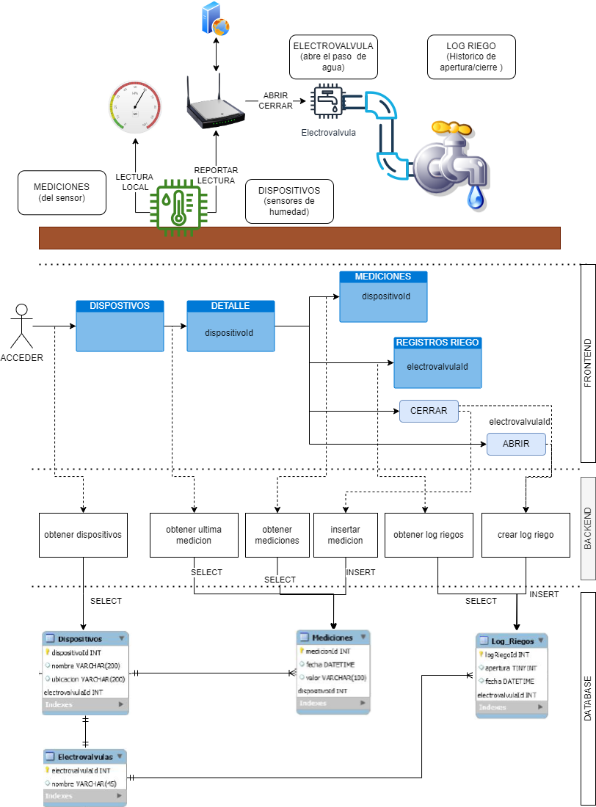
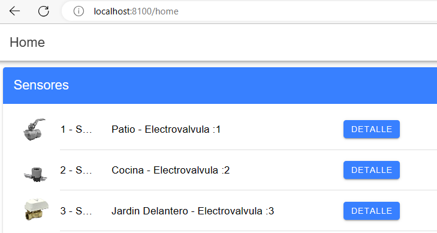
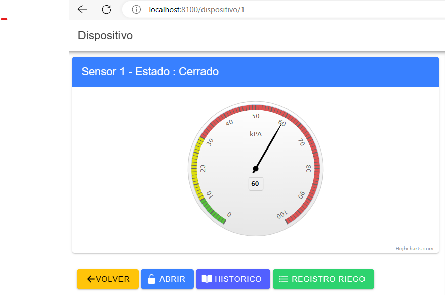
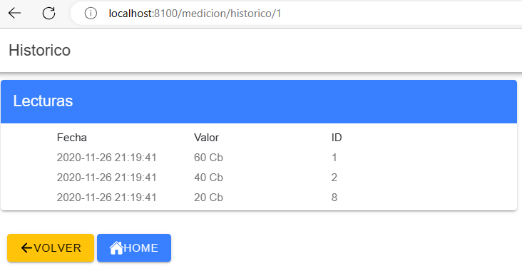
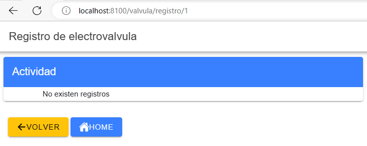

TP DAM
========================================

Proyecto basado en [Web App Full Stack Base](https://github.com/gotoiot/app-fullstack-base).

### Instalar las dependencias

Para correr este proyecto es necesario que instales `Docker` y `Docker Compose`. 
Continua con la descarga del código cuando tengas las dependencias instaladas y funcionando.

### Ejecutar la aplicación

Para ejecutar la aplicación tenes que correr el comando `docker compose up -d --build ionic-ui` una vez finalizado ejecutar `docker compose up` desde la raíz del proyecto. 
Si no es posible iniciar se debe detener y ejecutar nuevamente `docker compose up`
Para acceder al cliente web ingresa a a la URL [http://localhost:8100/](http://localhost:8100/) y para acceder al admin de la DB accedé a [localhost:8001/](http://localhost:8001/). 

Si pudiste acceder al cliente web y al administrador significa que la aplicación se encuentra corriendo bien. 

> Si te aparece un error la primera vez que corres la app, deteńe el proceso y volvé a iniciarla. Esto es debido a que el backend espera que la DB esté creada al iniciar, y en la primera ejecución puede no alcanzar a crearse. A partir de la segunda vez el problema queda solucionado.

# Arquitectura

# Funcionamiento
Al iniciar, se accede al sitio primcipal.[http://localhost:8100/](http://localhost:8100/)
## Home [http://localhost:8100/home](http://localhost:8100/home) 

> La pagina inicial carga todos los dispositivos y su detalle es accesible mediante el botón asi llamado

## Detalle  [http://localhost:8100/detalle/1](http://localhost:8100/detalle/1)

>Permite ver el ultimo estado de un sensor , desde esta pantalla se pueden :
- Volver
- Cerrar o Abrir la electovalvula
- Consultar el historico
- Consultar el registro de activacion de la electrovalvula

## Abrir-Cerrar
 
 Emula la apertura o cierre, generando un valor aleatoreo el cual se guarda como medicion nueva
 Tambien se guarda la operacion (apertura o cierre) como parte de los registros de riego
 Siempre se considera abierta inicialmente

## Historico

>Permite consultar las mediciones previas 

## Registro Riego

>Permite consultar la apertura cierre de la electrovalvula

>Todas las operaciones son efectuadas en el momento, no existe algun tipo de cache o carga de datos parcial.
Tampoco existe limitacion para la apertura o cierre de la electrovalvula, por lo tanto se mostraran tantos registros como existan.

### Estructura de la DB

Se respeta el archivo inicial de datos en  `db/dumps/smart_home.sql` para crear la base de datos automáticamente.

### Frontend
* Se ajusta el dockerfile para poder incorporar la api highcharts
* Uso de directivas ngIf cuando no existen registros de cambios o mediciones.
* Uso de directivas ngFor para al recuperar los datos en el home, en la pagina de mediciones y de registros
* Se creo la directiva resaltar en src/frontend/dam/src/app/directive, cuya funcion es colorear de beige cuando el mouse se posiciona sobre el elemento que lo emplee, en este caso se uso para las tablas de mediciones y registros.
* Los pipes custom se encuentran en src/frontend/dam/src/app/pipe.
* Se definen 3 pipes, uno para formatear fecha , otro para pasar de KPa a CB , y para informar el estado (1 abierto, 0 cerrado).
* El servicio se encuentra en /src/app/services , existen dos, pero uno es para acceder a los datos, el otro seria responsable de comunicarse con el dispostivo.
* La api en express se encuentra en src/backend
* Si la URL no es valida, se redirije al /home.

### Backend
* Se dividio en un archivo por acceso a datos (dispostivo, mediciones y log riego).
* Se valida la informacion rrecibida para poder efectuar las consultas a base de datos.
* En caso de error se responde con un detalle minimo sobre el posible problema.